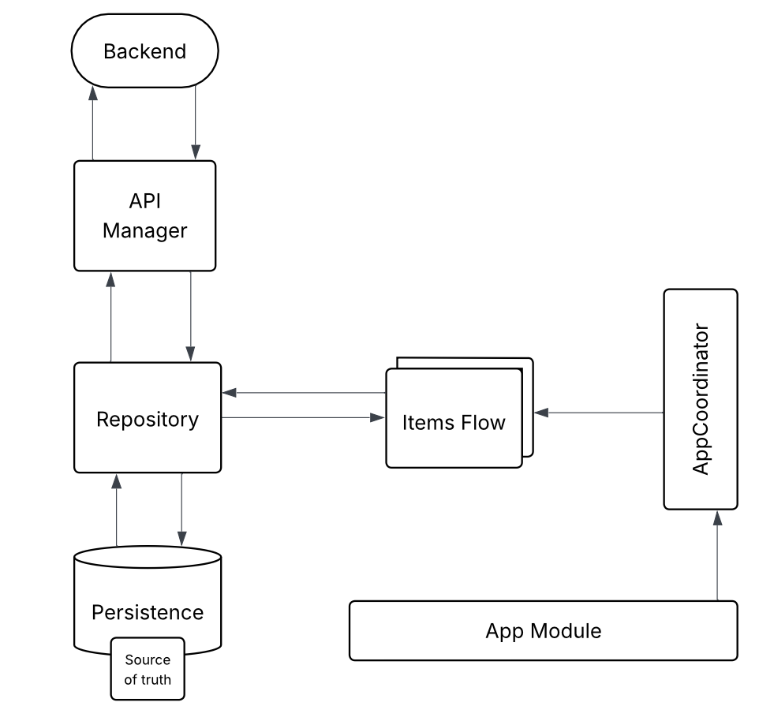

# HierarchyViewer

HierarchyViewer is a native iOS App built with SwiftUI and displays hierarchical content in the form of Pages, Sections, and Questions. The App fetches JSON content from a remote endpoint, presents it in a visually structured and interactive layout, and supports features like pull-to-refresh, error handling, and offline caching.

## Requirements
- iOS 18.0+
- Xcode 16.0

## Table of Contents

- [Features](#features)
- [Architecture](#architecture)
- [Installation](#installation)
- [Testing](#testing)
- [Dependencies](#dependencies)
- [Contact](#contact)

## Features

- **Hierarchical Data Listing:**  
  Render pages, sections, and questions with an adaptive, recursive interface.
- **View Question Details:**  
  For questions with image content, tapping on the image opens a dedicated details screen that displays the full-sized image along with its title.
- **Pull-to-Refresh:**  
  Easily refresh content incase of any network failure.
- **Error Handling:**  
  Display error prompts with retry options when network requests fail.
- **Offline Support:**  
  Use CoreData for local caching of fetched data.

## Architecture
<p align="center">

</p>

- **MVVM:**  
  The app uses the Model-View-ViewModel (MVVM) pattern for separation of concerns.
- **AppCoordinator:**  
  The AppCoordinator handles app routing and dependency injection.
- **CoreData:**  
  The app utilizes CoreData for persistent storage and offline capabilities. CoreData is the source of truth for data in the `HierarchyViewer` App so when data is retrieved from the Network, it is saved to CoreData and coreData triggers a view update using `NSFetchedResultsControllerDelegate`
- **APIManager:**  
  The app features a dedicated network layer responsible for making asynchronous API requests and decoding JSON responses. When new data arrives from the network, the Repository updates the CoreData store accordingly.
- **ARepository Pattern:**  
  The `ItemRepository` acts as an intermediary between the Network Layer and CoreData, abstracting data access logic. It ensures that any network-fetched data is immediately persisted in the local database, making CoreData the single source of truth.

## Installation

1. **Clone the Repository:**

   Open your terminal and run:

   ```bash
   git clone https://github.com/ayafayad/HierarchyViewer.git
   cd HierarchyViewer

2. **Open the project in Xcode**
3. **Build and Run:**

   Ensure you're using Xcode 16 (or later) with support for iOS 18.0 (or higher).

   Select your target device or simulator.
   
   Press `CMD + R` to build and launch the app.

## Testing

- Unit Tests:

  Unit tests cover all the App's logic including but not limited to viewModels, Repository actions, and CoreData operations. Tests are located in the `HierarchyViewerTests` target.

- UI Tests:

  UI Tests are not yet implemented. 

- Running Tests:

  Use Xcode’s Test Navigator `(CMD + U)` to execute the tests.

## Dependencies

- **SwiftUI**: For building the user interface.
- **CoreData**: For local data persistence.
- **Network Framework**: To monitor network connectivity.
- **Swift Concurrency** (async/await): To handle asynchronous operations.
- **SF Symbols**: Used for icons (e.g., refresh, error prompts, folder icons).

## Contact

For questions or support, please contact Me, Aya Fayad at ayafayad996@gmail.com.